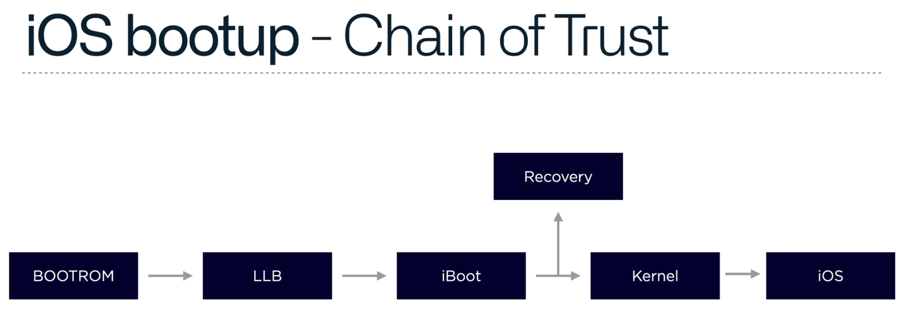
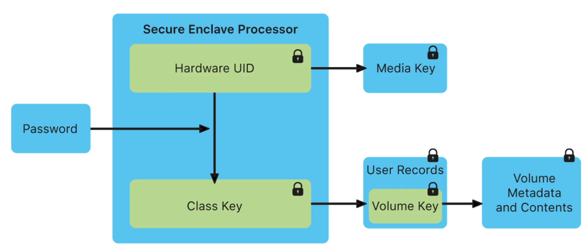
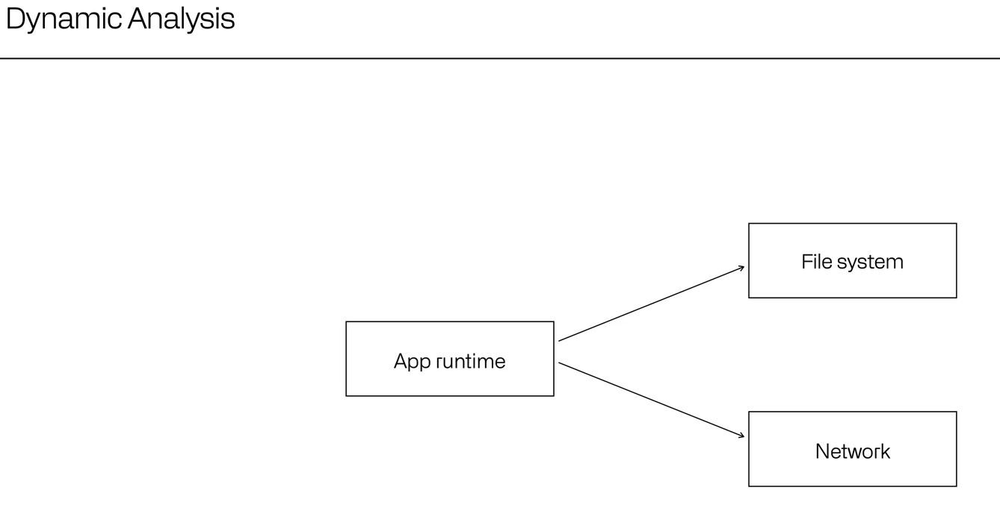

# IOS Pentest





### Secure Enclave

- Includes the Secure Enclave processor for sensitive actions and data operations
- Strong Isolation from the main processor
- Runs Apple-customized version of the L4 microkernel.
- BootROM for hardware root of trust
- Encrypts data at rest with keys derived from user’s passcode and hardware key from the Secure Enclave
- Protects against brute force attempts
- Refuses to unlock after 10 failed attempts
- Directly communcates with biometric authentication data (FaceID, TouchID)





### Platform Security

- Robust in-built security mechanisms by Apple
- Integrity and authenticity checks of bootup components
- Secure Boot with Boot ROM
- Address Space Layout Randomization and ARM's Execute Never (XN)
- Secure Enclave: key generation and storage
- Evaluation of biometric data for Touch ID and Face ID
- Kernel Integrity Protection (KIP)


### Secure Software updates

- Checksum verification for iBoot, kernel and OS image
- Replay attack protection using a random nonce
- Unique updates using Exclusive Chip Identification (ECID)
- Prevents against downgrade


### Application Security

- Default security protections through secure APIs, compiler settings and Xcode configuration
- Data Protection available for file and database APIs (NSFileManager, CoreData, NSData, SQLite)
- Application vetting by the App Store
- Code signing check for executable memory and binary
- Third-party Apps run with non-privileged user "mobile"
- Enforcement of Entitlements
- Sandboxing of application binary and data
- Jailed environments for processes
- Fairplay DRM
- Keychain for secure data storage


### Jailbreaking

- Lowers down the defence for platform and application security features by iOS
- Barrier for security research - application and platform
- From Jailbreak tweak to iOS: Wi-Fi/Bluetooth settings in Control Center, Compact call interface
- Mostly relies on Kernel exploits, some also in BootROM


### Types of Jailbreaking

- Untethered:
  - Kernel patched automatically at boot up
  - Normal boot up to jailbroken mode
- Tethered:
  - Only temporary jailbreak
  - If device reboots, needs to be jailbroken again (else, Recovery) 
- Semi-tethered:
  - Device boots up by itself but in stock iOS mode
  - For jailbreak mode, device must be booted using a computer
- Semi-untethered:
  - Similar to semi-tethered but can be re-jailbroken with an application


### Signing

any application you install it from app store it is signed by apple, you can run it successfully on the IOS device. but if you have IPA IOS application you need to install it in the device (you want to install a custom third party application on a device), it still needs to be signed in order to run on the device. and signing in IOS is totally different compared to signing to android.

For an application to run on the device, it needs to be signed and has a provision profile that indicateds that this application can run on the device. we can do this with tool called apple sign. With applesign we can sign application binaries or packages with a signing identity and provision profile, so you can run the application successfully on the device.

``` bash
npm install -g applesign
```


### IOS File system

- APFS (apple file system): file system for IOS, iPadOS, macOS, tvOS and watchOS
- Application processes run under `mobile` user
- Jailbreaking allows us to explore the file system without limitations
- Explore different Applications, System apps, Services, Daemons
- Data Storage locations for applications
- Uncover and Reverse Private APIs 


- All installed applications are exist in `/Applications/`
-  . whenever you install an application on IOS, the aplication bundle gets install in `/var/containers/Bundle/Application/unique_id/app_name.app/app_name`
- Applications data are exist in `/var/mobile/Containers/Data/Application/unique_id/`
- Data for system applications `/var/mobile/Library`
  - data for notes application: `/var/mobile/Library/Notes/notes.sqlite`
  - data for safari: `/var/mobile/Library/Safari`
  - data related to the application history: `/var/mobile/Library/FrontBoard/applicationState.db`


## Instrumentation & Debugging

if we gain access to the binary runtime, we can see what the application is doing in real time and modify its behaivour at lower level




in dynamic analysis, we looked at what is the 

- file system activity like new files created or modified files and data stored in the files  
- network activity like intercepting the traffic using burp

so we monitored what is the consequences of the application runtime not the application runtime itself


in binary instrumentation, instead we look atthe output, we look at the application runtime itself. and this allow us to look at the application and explor it at a much deeper layer. so here we are modifing the action itself not the  consequences of action.

using Instrumentation with frida gives us the flexbility to do things like hooking  methods, functions and modifing them and also hook a specific memory address and modify the instructions or rigister values.


we can explor the application and the state of the application at a giving moment such as when a button is pressed or an api call is made what is the state of the application, what are the different variables, what are the methods that have been called, what are the different arguments and so on.

we also can use instrumentation to extend functionalities or bypass the security restrictions that apps might suppose like bypassing the initial lock screen or to bypass jealbreak detection. 

we can debug the application at a more higher level, so we can walk through indiviual functions, methods and see how the entire application flows and use that information to identify vulnerabilities.


the way we can achive all of thses by gaining access to the application runtime and explor the application with read/write ceartain components of the application such as functions, arguments and even rigisters  


we will use `frida` and `frida-trace` and use `frida-trace` with flags `-i / -m` which allows us to hook to native APIs and objective-C APIs and once we traced different methods and instructions will then modify the handler files. 

and for frida we will use `REPL` as well as creating custom scripts and passing it to frida cli 


### App exploration with instrumentation

we will use frida to explor the application and know about different methods, functions and elements that are present on the screen of an IOS application and how to modify some of those components 

```
ideviceinstaller -l | grep -i uncrackable


to uninstall UnCrackable
ideviceinstaller -U sg.vp.UnCrackable1

to install UnCrackable
ideviceinstaller -i ucl1_signed.ipa 
```


get the process id of UnCrackable

```
ps ax | grep UnCrackable
```


connect to frida

```
frida -U -p process_id
```


```
frida> Process.arch
frida> ObjC.enumerateLoadedClassesSync()
```


view class methods

```
frida> ObjC.classes.ViewController.$ownMethods
```


printout every thing in the screen 

```
frida> console.log(ObjC.classes.UIWindow.keyWindow().recursiveDescription().toString())
```


### Modify return value and arguments with frida


